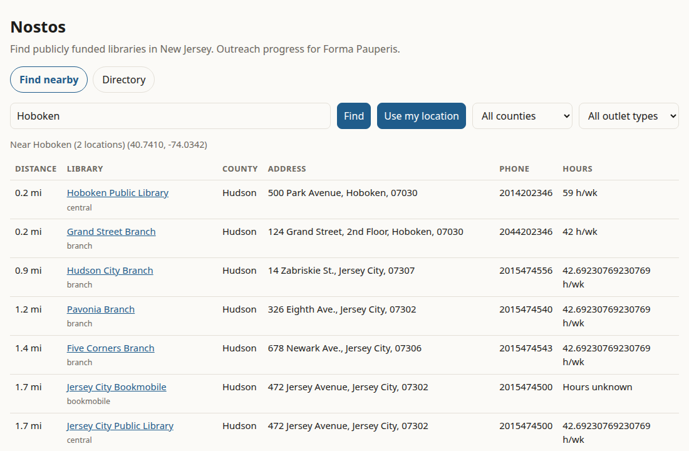
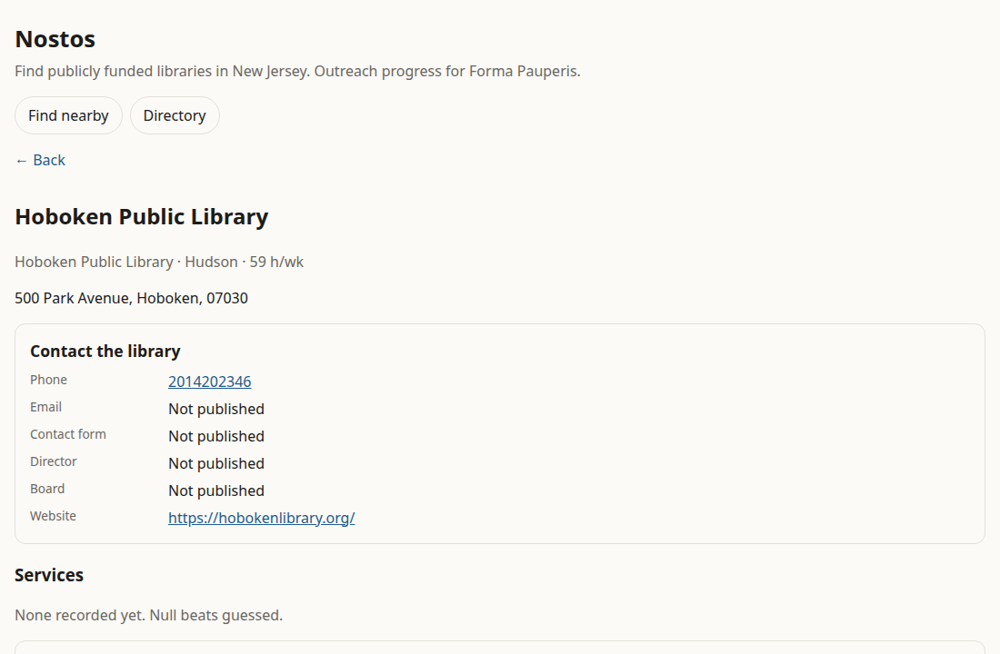

# Nostos

[](https://github.com/jacobyoby/nostos/actions/workflows/ci.yml)
[](https://www.imls.gov/research-evaluation/data-collection/public-libraries-survey)

Find the public library near you and what it offers.

A library is not a restaurant. **Nostos has no ratings, no stars, and no reviews.** People can name a service, note hours or a closure, or say a book is at a location. Those proposals go to a moderation queue, never onto the page.

v0.1.0 covers every active IMLS public library outlet in **New Jersey** (449 locations, 21 counties).

<p>
  
</p>
<p>
  
</p>

## Try it

Static HTML + JSON. From the repo root:

```bash
python3 -m http.server 8080
# open http://127.0.0.1:8080/src/
```

| You type | You get |
| --- | --- |
| ZIP `07030` or town `Hoboken` | Nearest outlets, miles, phone, hours |
| Device location (or deny it) | Same list, or ZIP/town fallback |
| A library name | Outlet page: **contact the administration** first, then services, then a proposal form |

Web, Android, and iOS share that UI (Capacitor 7).

## Product rules

- **Publicly funded only.** The universe is the [IMLS Public Libraries Survey](https://www.imls.gov/research-evaluation/data-collection/public-libraries-survey) outlet file. Anything not in IMLS needs a citation before it goes in.
- **Contact is first-class.** Phone, email, contact form, director, and board belong above the fold. Unpublished fields say “Not published” — never guessed.
- **Null beats guessed.** Services stay empty until there is evidence.
- **No comment threads.**

## Data (NJ, FY2023)

| File | What |
| --- | --- |
| [`data/imls-nj-outlets.json`](data/imls-nj-outlets.json) | 449 active outlets from IMLS PLS FY2023 (`scripts/ingest_imls_nj.py`) |
| [`data/nj-libraries.json`](data/nj-libraries.json) | Merged list: website, legal-help flag, services, admin contact, outreach (`scripts/merge.py`) |
| [`data/proposals/`](data/proposals/) | Community queue. Accepted proposals are applied on merge; rejected ones keep a reason |

Each service is `{name, evidence_url, verified_on}`. Names: legal-help desk, lawyer-in-the-library, notary, passport, printing/scanning, meeting rooms, tax prep, language help, computer access, other.

## Develop

```bash
npm install
npm test              # builds www/, unit + mobile project checks
npm run check:data    # JSON parse + http(s) URL schema
npm run test:e2e      # Playwright
npm run test:all
```

Android / iOS:

```bash
npm run build:www && npx cap sync
npm run android:assemble   # SDK + JDK
npm run ios:pod            # macOS + Xcode
```

CI runs on every push and PR. Intended production host is loam (with the other jacobrakai static sites). Until that path is wired, serve `src/` + `data/`, or `www/` after `npm run build:www`.

## Status

Open work lives in [issues](https://github.com/jacobyoby/nostos/issues): per-day hours, municipal boundaries, remaining NJSL name matches, production hosting.
